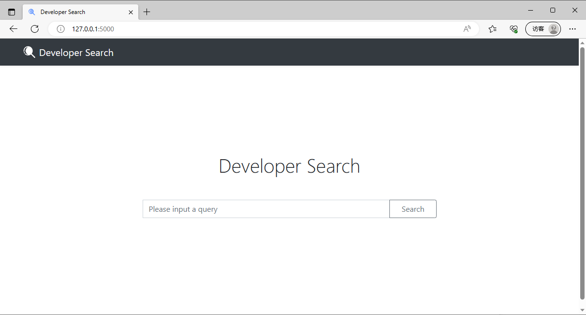

# 开发者搜索数据抽取

## 开发工具和数据源

- Java
    - [JDK 1.8](https://www.oracle.com/jp/java/technologies/javase/javase8-archive-downloads.html)
- MongoDB
    - [MongoDB](https://www.mongodb.com)
    - [Install MongoDB Community Edition on Windows](https://www.mongodb.com/docs/manual/tutorial/install-mongodb-on-windows)
    - [MongoDB安装教程](https://www.cnblogs.com/TM0831/p/10606624.html)
    - [BSON](https://www.mongodb.com/docs/manual/reference/bson-types)
    - 踩坑：MongoDB的Key一定不要有`.`和`$`
- Maven
    - [Maven Central Repository](https://mvnrepository.com)
    - lombok
        - [lombok](https://projectlombok.org)
        - [GitHub](https://github.com/projectlombok/lombok)
    - jsoup
        - [jsoup](https://jsoup.org)
        - [GitHub](https://github.com/jhy/jsoup)
    - tree-sitter
        - [tree-sitter](https://tree-sitter.github.io)
        - [GitHub](https://github.com/tree-sitter/tree-sitter)
        - [Documentation](https://tree-sitter.github.io/tree-sitter)
- Data Source
    - Java API
        - [JDK 19.0.1 API Doc](https://docs.oracle.com/en/java/javase/19/docs/api/index.html)
        - [JDK 19.0.1 API Doc Download](https://www.oracle.com/java/technologies/javase-jdk19-doc-downloads.html)
    - CodeSearchNet
        - [GitHub](https://github.com/github/CodeSearchNet)
        - [Paper](https://arxiv.org/abs/1909.09436)
        - [Java代码数据下载](https://s3.amazonaws.com/code-search-net/CodeSearchNet/v2/java.zip)

## 方法级代码数据抽取

- 直接给定类全名：小写字母开头的`package`名+大写字母开头的`class`名。
- 没有给定类全名：获取方法级代码对应的类级代码，遍历可选类名并匹配，进而获取类全名。
    - 从`import`信息获取类全名。
        - 静态导入的内部类：从`import static`获取。
        - 导入的类：从`import`获取。
        - 导入的包中的类：从`import <package_name>.*`获取。（**难点**）
    - 将`package`名+当前类名组成当前类全名。
    - 遍历当前类的非`private`内部类，将当前类全名+内部类名组成内部类全名。
    - 遍历当前`package`，将`package`名+对应类名组成同包类全名。

## 开发者搜索

